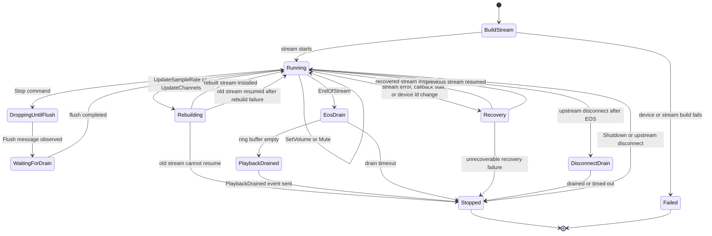
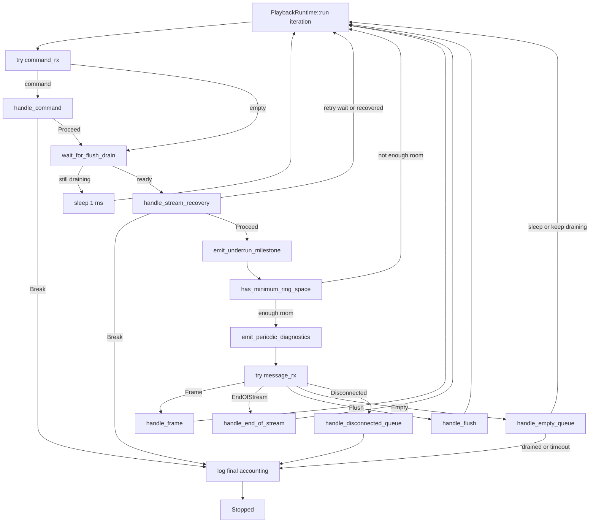
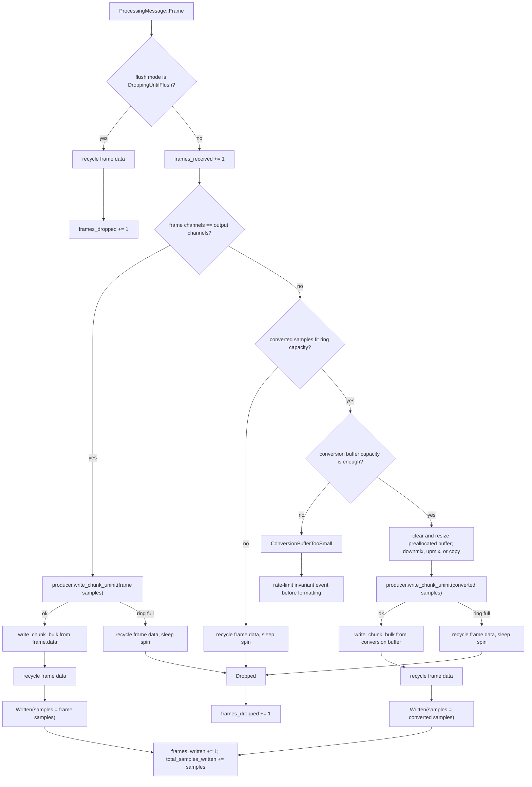
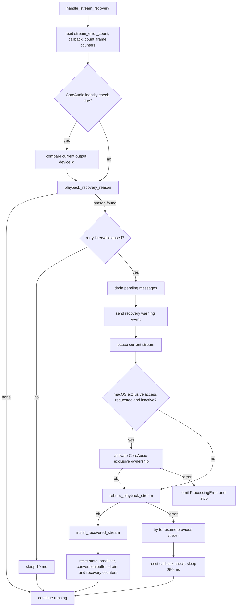

# sotf-engine Architecture

This document complements `README.md` with implementation-level diagrams for
the playback runtime state machine.

## Playback Runtime State Machine

`run_playback_thread` in `src/engine/playback_thread/runtime.rs` constructs a
`PlaybackRuntime` and then runs a synchronous owner loop. The runtime uses
`std::thread`, `std::sync::mpsc`, atomics, `cpal`, and `rtrb`; it does not use
Tokio. Upstream processing sends `ProcessingMessage`s to the runtime, the
runtime owns the `rtrb::Producer`, and the CPAL output callback owns the
matching `rtrb::Consumer`.

Logical state is kept in small structs rather than in one public enum:

- `DrainState` tracks EOS, flush, drain start, and drain timeout.
- `RecoveryState` tracks callback progress, stream errors, retry timing,
  CoreAudio identity checks, and underrun milestones.
- `PlaybackAccounting` and `DiagnosticState` track frame counters and periodic
  stats emission.

## Runtime Loop

Each loop iteration is intentionally ordered. Commands are handled before new
audio, flush completion is observed before accepting more frames, and recovery
is checked before the runtime writes into the ring buffer.

## Frame Hot Path

`write_frame_to_ring` in `src/engine/playback_thread/frame_writer.rs` is the
producer-side audio hot path. It must remain allocation-free after warmup:
conversion uses a preallocated `Vec<f32>`, direct writes use the incoming frame
buffer, and every path recycles the frame data exactly once. Logging, event
formatting, device lookup, and stream rebuilding stay outside this function.

## Stream Recovery

Recovery is part of the playback owner loop, not the CPAL callback. The callback
only updates atomics and uses the rate-limited stream-error log and event gates.
The owner loop later decides whether the stream needs rebuilding.

## Logging And Event Boundaries

The playback state machine has two different logging domains:

- CPAL stream-error callbacks use `rate_limited_log!` and a separate
  `rate_limit::allow` gate before formatting or sending warning events.
- `write_frame_to_ring` has no logging or event construction in direct,
  converted, or full-buffer drop paths.

Lifecycle logs and warning events are allowed in the owner loop because stream
rebuilds, device lookup, final accounting, and recovery are outside the per-frame
write path.
